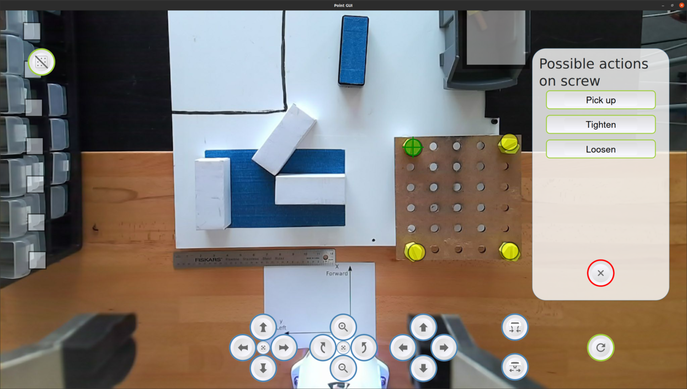

Task-Level Authoring for Robot Teleoperation
============================================
Point-and-Click GUI
-------------

*This work is part of the code for the implementation of the system presented in  Task-Level Authoring for Robot Teleoperation. It is designed to be used with the
[Robot Controller](https://github.com/emmanuel-senft/authoring-ros/tree/study).*

Pre-requisites
--------------

The Point-and-Click GUI depends on one QtQuick extensions:

- [ROS plugin for QtQuick](https://github.com/emmanuel-senft/ros-qml-plugin)
(adapted from Séverin Lemaignan's)

Install and compile before running the interface.

Installation
------------

Simply open the Qt project from QtCreator and run it from there.

Usage
-----

See [the Robot Controller repository](https://github.com/emmanuel-senft/authoring-ros/tree/study) for detailed usage.

Interface
---------

This interface is designed to select high-level actions for remote robot control as a control condition for the [Authoring Interface](https://github.com/emmanuel-senft/authoring-gui/tree/authoring-study). It communicates with the robot controller using the QML-ROS plugin to receive ROS messages (video and strings) and send commands as strings.

The main view presents the field from a robot mounted camera with a number of buttons surrounding it. An overlays on the video shows the position of objects known by the system and with which users can interact. The bottom buttons allow to move the camera in the 6 directions. Users can select objects and the right panel presents possible actions associated to these objects. To parameterize actions, users can right click on buttons and adjust sliders. Executing actions can be simply done by left clicking on the button.