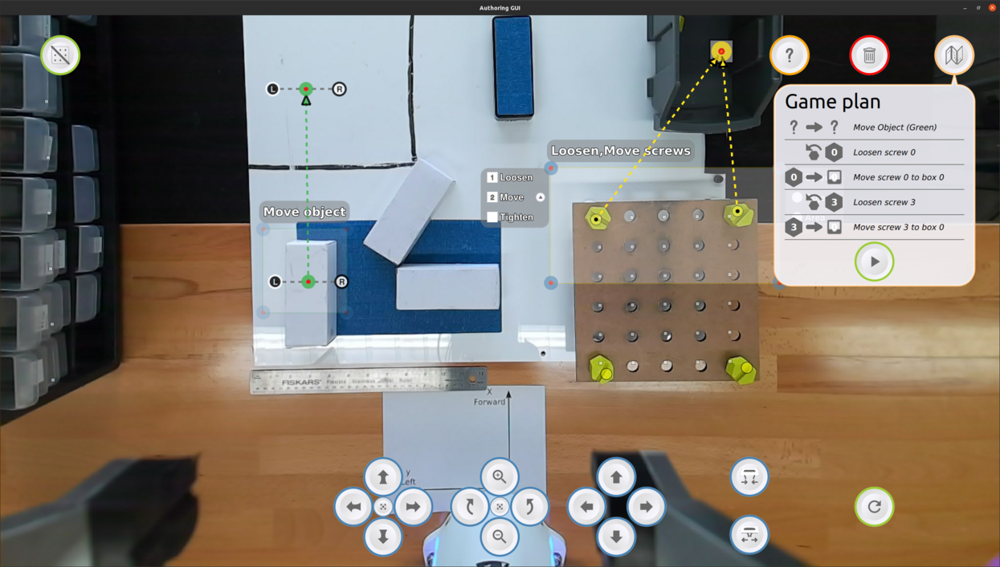

Task-Level Authoring for Remote Robot Teleoperation
============================================
Cartesian GUI
-------------

This work is part of the code for the implementation of the system presented in the paper *Task-Level Authoring for Remote Robot Teleoperation*. It is designed to be used with the
[Robot Controller](https://github.com/emmanuel-senft/authoring-ros/).*

Pre-requisites
--------------

The Cartesian GUI depends on one QtQuick extensions:

- [ROS plugin for QtQuick](https://github.com/emmanuel-senft/ros-qml-plugin/tree/study)
(adapted from Séverin Lemaignan's)

Install and compile before running the interface.

Installation
------------

Simply open the Qt project from QtCreator and run it from there.

Usage
-----

See [the Robot Controller repository](https://github.com/emmanuel-senft/authoring-ros/tree/study) for detailed usage.

Interface
---------

This interface is designed to provide cartesian control remotely as a control condition for the [Authoring Interface](https://github.com/emmanuel-senft/authoring-gui/tree/authoring-study). It communicates with the robot controller using the QML-ROS plugin to receive ROS messages (video and strings) and send commands as strings.

The main view presents the field from a robot mounted camera with a number of buttons surrounding it. The bottom buttons allow to move the camera in the 6 directions. To control the robot, users can enter the desired position of the end-effector on the right box and press play to send the robot there. Changed boxes are painted blue and errors red.
